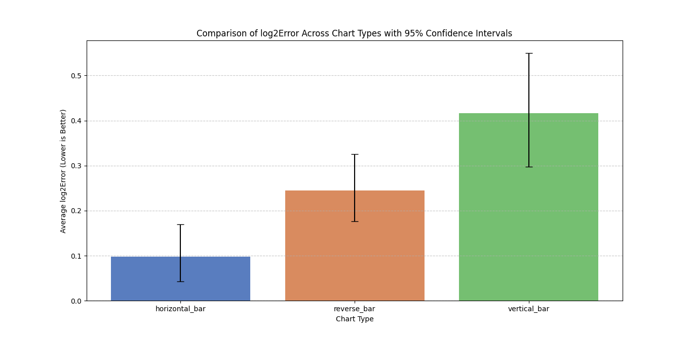

# reVISit study – Interactive, Web-Based User Studies  

Create your own interactive, web-based data visualization user studies by cloning/forking and editing configuration files and adding stimuli in the `public` folder.  

**You can try our study at** [https://joeyc5565.github.io/study/basic-questionnaire-study/](https://joeyc5565.github.io/study/basic-questionnaire-study/)

reVISit introduces reVISit.spec, a DSL for specifying study setups (consent forms, training, trials, etc.) for interactive web-based studies. You describe your experimental setup in reVISit.spec, add your stimuli as images, forms, HTML pages, or React components, build and deploy – and you're ready to run your study. For tutorials and documentation, see the [reVISit website](https://revisit.dev).  

---

## **Experiment Overview**  

This study evaluates how different **bar chart orientations** affect users' ability to extract numerical values accurately. We compare **horizontal, vertical, and reverse bar charts** to determine which format leads to the most accurate responses.

Participants were asked to identify specific values from bar charts, and their reported values were compared against the actual values to assess accuracy. The goal is to determine which bar chart orientation results in the least perceptual error.

---

## **Experiment Setup & Data Collection**  

- **Participants:** At least **10** participants were recruited.  
- **Trials per Visualization Type:** Each trial included **60 random questions**, totaling **660 trials** across all participants.  
- **Dataset Compilation:** Results were merged into a **master CSV** for analysis.  

Each trial followed these steps:  
1. A participant was shown a **randomly generated bar chart**.  
2. They were asked: *"What is the value of column 5?"*  
3. Their **reported integer value of column 5** was recorded.  
4. The **CorrectValue** was extracted from the dataset.  
5. **Error and log2Error were calculated** based on Cleveland & McGill’s method.  

---

## Error Calculation Method  

We calculated **Error** using the following equations:  

log2Error = log2(|ReportedValue - CorrectValue| + 1/8)

- If **ReportedValue == CorrectValue**, `log2Error` is set to **0** instead of `log2(1/8) = -3`.  
- This prevents distortion at small errors and provides a better measure of perception differences.  

---

## **Results & Visualization Performance**  

The following visualization compares the **average accuracy (proportion correct)** across the three bar chart orientations. **Higher values indicate better accuracy, meaning participants made fewer mistakes. Lower values indicate worse accuracy.**

### **Results Chart**  
  

### **Log2Error Analysis with Confidence Intervals**  
In addition to accuracy, we computed **log2Error**, which measures how far participants' responses deviated from the correct value on a logarithmic scale. Lower log2Error values indicate better performance.  

#### **Log2Error Comparison Chart**  
  

#### **Key Observations:**  
- **Horizontal bar charts** resulted in the **lowest log2Error**, meaning participants made the smallest estimation errors.  
- **Reverse bar charts** had **moderate log2Error**, showing some difficulty in estimating values accurately.  
- **Vertical bar charts** had the **highest log2Error**, indicating the most significant errors in value perception.  

---

---

## **Confidence Intervals (Bootstrapped 95%)**  
To ensure robust results, we computed **bootstrapped 95% confidence intervals** for both **accuracy** and **log2Error** of each bar chart orientation.

- **Implementation:** This was done using **Python with pandas, Matplotlib, and Scipy bootstrap methods**, not R (ggplot2).  
- **Result:** The ranking of visualizations remained stable within the confidence intervals, further validating the conclusions.  

## Example Bar Charts Used in the Experiment  

| Chart Type              | Example |
|-------------------------|---------|
| **Horizontal Bar Chart** |  |
| **Vertical Bar Chart**   |  |
| **Reverse Bar Chart**    |  |

---

## **Technical Achievements**

- **Tooltip Removal:** Tooltips, which display data values when users hover over the bars, were removed to prevent participants from cheating.
- **Dynamic Data Fetching:** Implemented dynamic data fetching from a JSON file to ensure that each trial uses a unique set of data points, enhancing the randomness and reliability of the experiment.
- **Consistent Logging** Logs the array of datapoints showing in the graph that appears in the console for each trial. It helps with debugging and testing.

## **Design Achievements**

- **Single-page generation:** The study's JSON files for questions select one of three graph generators, each of which randomizes the trial for the graph.
- **Changed Styling:** Added necessary padding to ensure graphs have good spacing. Mae sure that graphs have good contrast with the white background.
- **py for data generation:** Created Python file to generate data for the study. It generates a JSON file with the data for the study that is random and is used to create the visualizations. 

## **Build Instructions**  

To run this demo experiment locally, install Node.js on your computer:  

* Clone `https://github.com/revisit-studies/study`  
* Run `yarn install`. If you don't have yarn installed, run `npm i -g yarn`.  
* To run locally, run `yarn serve`.  
* Go to [http://localhost:8080](http://localhost:8080) to view it in your browser. The page will reload when you make changes.  

---

## **Release Instructions**  

Releasing reVISit.dev happens automatically when a PR is merged into the `main` branch. The name of the pull request should be the title of the release, e.g., `v1.0.0`. Releasing creates a tag with the same name as the PR, but the official GitHub release should be created manually. The `main` branch is protected and requires two reviews before merging.  

The workflow for release looks as follows:  
Develop features on feature branch  
→ PRs  
→ Dev branch  
→ PR (1 per release)  
→ Main branch  
→ Run release workflow on merge  
→ References are updated and commit is tagged  
